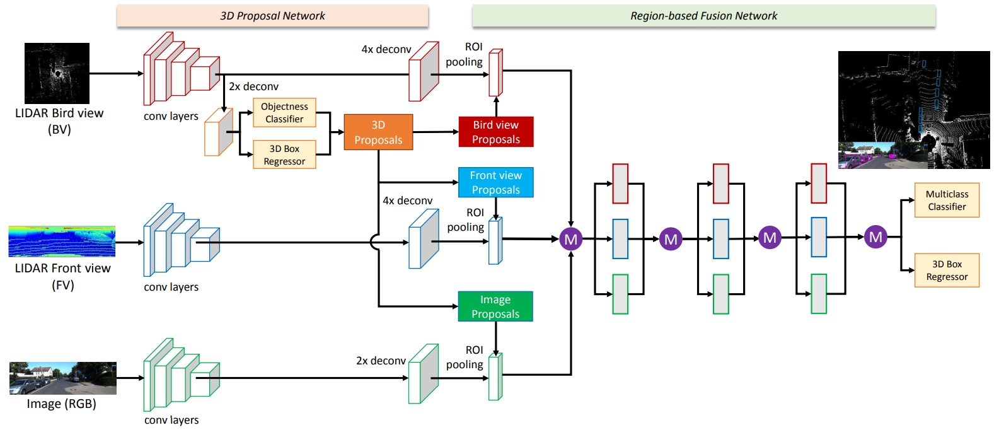

# Awesome Point Cloud Papers

点云处理（Classification、Segmentation、3D Detection）的文章，有这么几个大概的做法：直接处理原始点云数据（以PointNet为代表）、将原始点云数据体素化（离散化）、融合点云数据和RGB数据。比较小众，或者说我倾向做的方法是伪点云，即从深度图中得到的点云，所谓的Depth Completion，我的想法是融合低线激光雷达和RGB（语义分割）得到语义分割后的伪点云图，然后进行3D Detection，应用在低速场景下。这个Motivation需要不断让别人challenge。
## I. Raw Point Cloud
>直接处理点云原始数据
>参考：
>1.https://blog.csdn.net/sunfei05/article/details/80451808
>2.https://zhuanlan.zhihu.com/p/44809266

### 1. PointNet
处理纯点云数据的开山之作算是。解决了CNN应用在点云的方法。

### 2. PointNet++
参考：https://blog.csdn.net/sunfei05/article/details/80451808
[评论]我觉得PointNet++实在太复杂了，超参数也很多，全都是在set abstract结构里面。
PointNet解决了点云的无序性等，获得了全局的特征，全局指的是一帧内所有点云的特征。其实更适合作为一个模块来使用。
但是对于点云分割这种密集的任务，需要局部特征，这是来自图像语义分割的经验。但是如何提取局部特征？
首先，定义什么是局部。点云是空间中非常稀疏的并且不均匀的，cnn连续的移动是浪费时间且无意义的。那么就需要先找出来点云比较密集的区域（局部）。然后在这个局部中用PointNet提取特征。
作者用了一个叫做set abstract的结构，即包括三个部分，找出局部，并利用PointNet。
1）sampling layer
这一步从所有点云中找到密集区域的中心点，是所有点云的子集。
这里面用了一个Farthest Point Sampling算法，参看https://blog.csdn.net/seamanj/article/details/52028904 加深下直观理解
2）grouping layer
上一步找到了局部点云的中心点，下面找一个半径，把这个中心点球形内的点云当做局部特征的点云，每个球形内的点云数量K不相等，然后送到下面的PointNet提取局部特征。
3）PointNet layer

这样的点云分布还是不均匀的，作者用MSG或MRG来解决。

### 3. F-PointNet
>利用RGB和D信息生成的视锥体做3d detection

### 4.PointSIFT: A SIFT-like Network Module for 3D Point Cloud Semantic Segmentation

>上海交大组的工作

## II. Voxelized/BEV Point Cloud
>将点云数据先进行与处理，所谓体素化，这样就可以点云数据结构化了，方便进行CNN处理，尤其是BEV视角，精度很高了。这方面工作都是Uber Raquel Urtasun组的，感觉做的空间不大了。
### 1.VoxelNet
Apple的工作，参考https://zhuanlan.zhihu.com/p/40051716

### 2.Fast and Furious: Real Time End-to-End 3D Detection, Tracking and Motion Forecasting with a Single Convolutional Net

### 3.PIXOR: Real-time 3D Object Detection from Point Clouds

## III. Point Cloud and RGB
>所谓融合点云和RGB信息，在CNN提取出来的特征feature上进行concat之类

### 1.Joint 3D Proposal Generation and Object Detection from View Aggregation(AVOD)

### 2.Multi-View 3D Object Detection Network for Autonomous Driving(MV3D)
并没有仔细看这篇文章，通过下图基本可以看出来融合了点云BEV和点云FV，再加上RGB，有点胡来瞎融合的感觉。太简单粗暴了，速度也一定超级慢。

## IV. Depth Completion
>The goal of the depth completion task is to generate dense depth predictions from sparse and irregular point clouds which are
mapped to a 2D plane.

### 1.Sparse and Dense Data with CNNs:Depth Completion and Semantic Segmentation
比较实在的文章，没有fancy的模型，做了实验证明了一些事情：
1. vality mask没啥用，在后面几层就失效了；
2. late fusion稀疏点云和rgb比较好，甚至不要rgb其实也行（Note that sparse depth is much more important as modality than RGB, even at this low sparsity level, because the input is effectively a subset of the ground truth.）；
3. 处理稀疏点云，去掉bn，因为zero values of missing pixels falsify the mean computation of the batchnorm layer；
4. 训练时候可以变化点云的稠密度density；
5. loss的话，只计算gt中未出现的像素（因为稀疏点云是gt的子集啊，所以稀疏点云的loss就不算了，我理解是这样，不知道作者是不是这个意思）we compute the loss only
on unobserved pixels available in the ground truth

### 2.Sparse and noisy LiDAR completion with RGB guidance and uncertainty

PCN: Point Completion Network 这个更像是从点云中补全点云