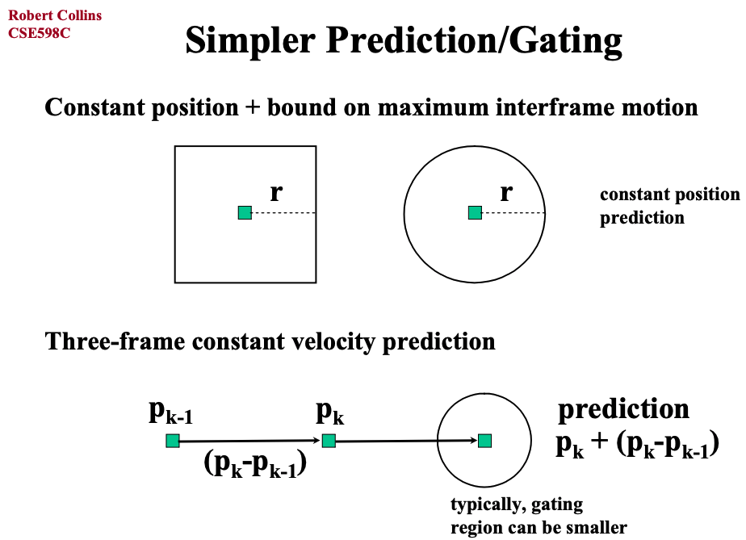
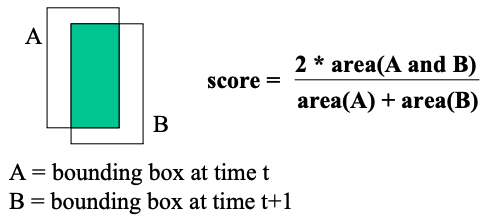
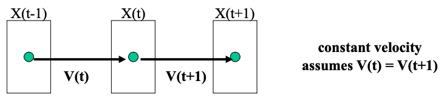
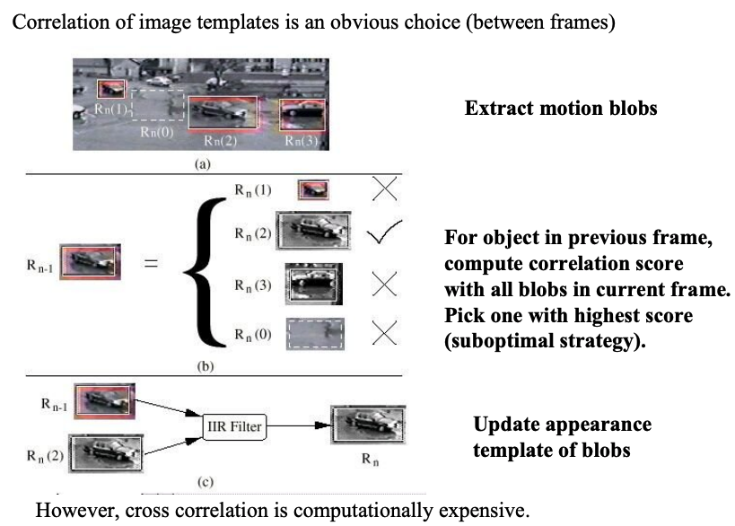

# Introduction to Data Association
>参考：http://www.cse.psu.edu/~rtc12/CSE598C/datassocPart1.pdf
>Data Association主要与Object Tracking有关
## Intro
跟踪(Tracking)时，很自然：
1.检测每帧中的物体
2.计算帧间物体的关联
那么第二点，就是Data Association了。

## Filtering和Association
1. 滤波Filtering
a. Predict
b. Update
2. Association
加入了Gating和Data Assocation
a. Predict
b. Gating to determine possible matching observations
c. Data association to determine best match
d. Update

## Gating
A method for pruning matches that are geometrically unlikely from the start. Allows us to decompose matching into smaller subproblems.
主要介绍了：Kalman Filter Predict/Gating、Simpler Predict/Gating和Global Nearest Neighbor

### Kalman Filter Predict/Gating

### Simpler Predict/Gating

### Global Nearest Neighbor

## Data Association
### Data association score
Similarity or affinity scores for determining the correspondence of blobs across frames is based on feature similarity between blobs. Commonly used features: location , size / shape, velocity, appearance.

1. location or size/shape

2. velocity

3. appearance

### Assign Problem
如果追踪多个物体，那怎么把每帧的物体匹配起来？可以计算个矩阵，元素就是前后两帧间的每个物体的match score，然后我们找到一一的对应，使得match socre最大，这就转化成了assign problem。然后用匈牙利算法(Hungarian Algorithm)求解。

