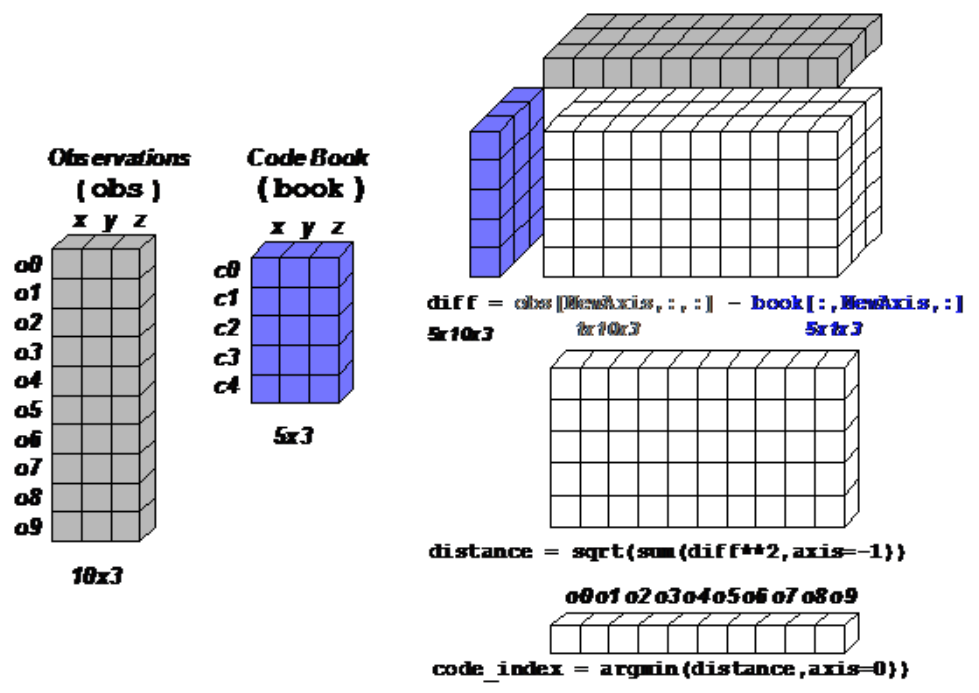

# numpy中的Array Broadcasting机制

## What is broadcasting?
The term broadcasting describes how numpy treats arrays with different shapes during arithmetic operations.
用来应对不同shape的ndarray计算。

*Subject to certain constraints*, the smaller array is “broadcast” across the larger array so that they have compatible shapes. Broadcasting provides a means of vectorizing array operations so that looping occurs in C instead of Python. It does this without making needless copies of data and usually leads to efficient algorithm implementations. There are, however, cases where broadcasting is a bad idea because it leads to inefficient use of memory that slows computation.
Broadcasting也有限制。小的array会在大的array上"broadcasting"。小数据集是broadcasting很efficient，大的数据集不是好主意。

## General Broadcasting Rules
什么时候可以用broadcasting，什么时候不行？
When operating on two arrays, NumPy compares their shapes element-wise. It starts with the **trailing** dimensions, and works its way forward. Two dimensions are compatible when
1.they are equal, or
2.one of them is 1
The size of the resulting array is the maximum size along each dimension of the input arrays.

先看个例子：
```python
A      (4d array):  8 x 1 x 6 x 1
B      (3d array):      7 x 1 x 5
Result (4d array):  8 x 7 x 6 x 5
```
这也行？？？

解释一下上面的这个"trailing"是什么意思，就是维度最右边开始逐位比较，如果两者相等，或者两者有一个是1也相当于相等，如果都比较一下发现相等，OK，就可以用Broadcasting.
看一下上面的例子，是符合这个Rules的。

## How to use?
我可以理解什么情况下broadcasting是合法的，但是，但是，我用起来肯定还是有障碍，因为，把shape变成1，我还没法想象出来。
参考[1]有个例子蛮好的。
Example:
Broadcasting comes up quite often in real world problems. A typical example occurs in the vector quantization (VQ) algorithm used in information theory, classification, and other related areas. The basic operation in VQ finds the closest point in a set of points, called codes in VQ jargon, to a given point, called the observation. In the very simple two-dimensional case shown in Figure 5, the values in observation describe the weight and height of an athlete to be classified. The codes represent different classes of athletes.1 Finding the closest point requires calculating the distance between observation and each of the codes. The shortest distance provides the best match. In this example, codes[0] is the closest class indicating that the athlete is likely a basketball player.

简单说就是我有一个新的observation数据，那我看看它距离各个类别有多远呢？然后我把observation分类给那个类别：
看下代码就明白了：
```python
from numpy import array, argmin, sqrt, sum
observation = array([111.0,188.0])
codes = array([[102.0, 203.0],
               [132.0, 193.0],
               [45.0, 155.0],
               [57.0, 173.0]])

diff = codes - observation
dist = sqrt(sum(diff**2,axis=-1))
nearest = argmin(dist)
```
这个我之前就懂啊，这种broadcasting的例子。现在，如果我们有10个observation呢？能同时算一下它们距离codes的距离吗？想一下怎么做？
看一下这个图，看图好，我差不多就能理解了。


##参考
1.http://scipy.github.io/old-wiki/pages/EricsBroadcastingDoc
2.https://eli.thegreenplace.net/2015/broadcasting-arrays-in-numpy/