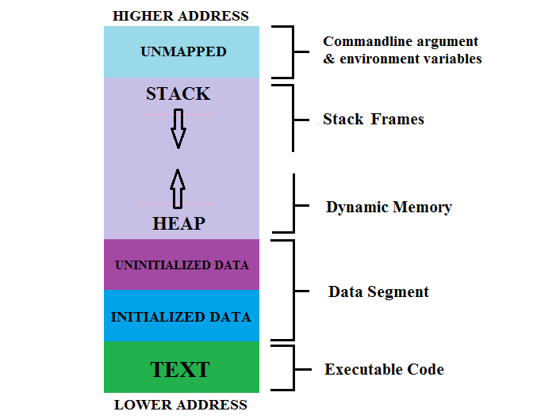
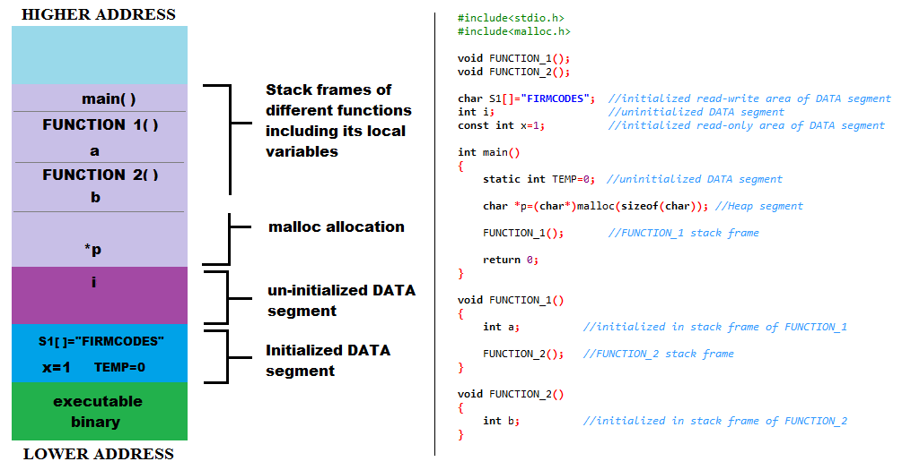

# C++内存分配(栈和堆)

**这里的栈和堆与数据结构的栈和堆是不一样的，这里的堆和栈是指内存分配的区域。** 如题图。
大体上分为：**栈区、堆区、数据区和代码区**。

1. **栈区**
**栈(Stack):** 为执行线程留出的内存空间，处于相对较高的地址向较低的地址拓展，是一块连续的内存空间，但能从栈区获得的空间较小。栈区内存由编译器自动分配释放（无序手动操作），编译时就确定了大小。栈区速度比堆区快很多。
**作用：** 主要用来保存函数的现场（形参、返回地址、相关运行状态）、函数内局部变量等。当发生函数调用时候：
函数调用时所建立的栈帧包含下面的信息：
- 函数的返回地址。返回地址是存放在主调函数的栈帧还是被调用函数的栈帧里，取决于不同系统的实现；
- 主调函数的栈帧信息, 即栈顶和栈底；
- 为函数的局部变量分配的栈空间；
- 为被调用函数的参数分配的空间取决于不同系统的实现。

举个例子，也顺便说明下主调函数和被调函数是什么意思：

上图中，`main()`函数是主调函数，`FUCNTION_1()`和`FUNCTION_2()`是所谓被调函数。

 2. **堆区**
**堆(Heap):** 是为动态分配预留的内存空间。堆是向高地址扩展的数据结构，是不连续的内存区域，堆获得的空间比较灵活，也比较大。由程序员分配释放(动态内存申请与释放)，若程序员不释放，程序结束时可能由操作系统回收。对于堆来讲，频繁的`new`/`delete`势必会造成内存空间的不连续性，从而造成大量的碎片，使程序效率降低。
**作用:** 用于存放动态分配的对象, 当你使用`malloc`和`new`等进行分配时,所得到的空间就在堆中。动态分配得到的内存区域附带有分配信息, 所以你能够`free`和`delete`它们。
例如上图中，指针`p`存放在堆区，因为它是用`malloc`创建的。

 3. **数据区**
分为非初始化数据区(BSS)和初始化数据区。非初始化数据区(BSS)用于存放程序的静态变量，这部分内存都是被初始化为零的；而初始化数据区用于存放可执行文件里的初始化数据。

 4. **代码区**
只读区，存放可执行的二进制代码。

##ref
[1]https://www.cnblogs.com/oc-bowen/p/5113475.html
[2]https://chenqx.github.io/2014/09/25/Cpp-Memory-Management/
[3]https://proprogramming.org/memory-layout-of-c-program/
[4]https://stackoverflow.com/questions/79923/what-and-where-are-the-stack-and-heap
[5]https://www.learncpp.com/cpp-tutorial/79-the-stack-and-the-heap/