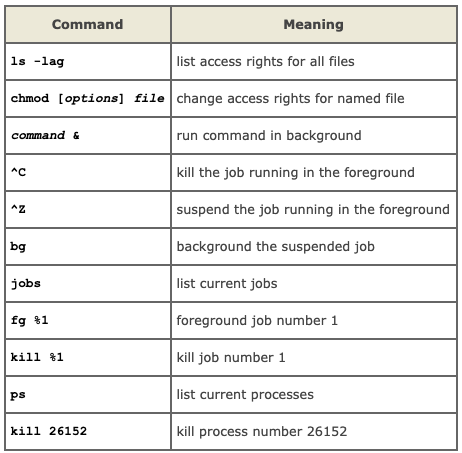

# Unix命令
> 遇到不懂的命令， 可以到下面网站查查看
> 1. https://wangchujiang.com/linux-command/
> 2. https://www.explainshell.com/#

1. `mv`: 移动文件；重命名文件
2. `cat`:把文件的内容打印到屏幕上
3. `less`:`cat`一次都打印上，然后就等着下一个命令；如果想像看文档一样，慢慢自己翻看文档，就用`less`；`less`还有一个功能，`less`一个文档后，可以`\keyword*`查找文档中要搜索的词
4. `head`:打印出文档的前十行
5. `tail`:打印出文档最后十五行
6. **`grep`**:经常看到它，它是file pattern searcher，它会搜索文档中特定的内容和模式。简单的用的话，就是`grep -n Point PointCloud.md`，查找文档中的包含字符Point的句子，然后显示行号（`-n`）。还有和很多命令一起使用的复杂情况，以后遇到再v分析。

7. Pipes很有意思
在Unix系统中，有管道的概念，这在命令行中也有所体现，即`|`这个符号，如果`|`前后有两个命令，那么它表示把第一个命令的输出作为第二个命令的输入。举个例子，我想知道当前文件夹下有多少个文件：`ls | wc -l`，第一个`ls`输出当前目录下的文件和文件夹，导入到第二个命令`wc`中计数。有意思有意思。

8. 文件权限
输入 `ls -l`，可能得到下图：

最开始的是个字符，就是图中`-rwxrw-r--`，第一个字符代表目录或者是文件，如果是目录，就是`d`，剩下的9个字符是三组文件权限：

>1. The left group of 3 gives the file permissions for the user that owns the file (or directory) (ee51ab in the above example); 
>2. the middle group gives the permissions for the group of people to whom the file (or directory) belongs (eebeng95 in the above example);
>3. the rightmost group gives the permissions for all others.

文件权限代表：
>- r (or -), indicates read permission (or otherwise), that is, the presence or absence of permission to read and copy the file 
>- w (or -), indicates write permission (or otherwise), that is, the permission (or otherwise) to change a file 
>- x (or -), indicates execution permission (or otherwise), that is, the permission to execute a file, where appropriate

9. `chmod`改变文件权限
例如： `chmod go-rwx biglist` 或者 `chmod a+rw biglist`

| Symbol | Meaning                        |
|:--------:|:--------------------------------:|
| u      | user                           |
| g      | group                          |
| o      | other                          |
| a      | all                            |
| r      | read                           |
| w      | write(and delete)              |
| x      | execute (and access directory) |
| +      | add permission                 |
| -      | take away permission           |

10. `ps`查看当前进程(process)
A process may be in the foreground, in the background, or be suspended.

11. 其他
